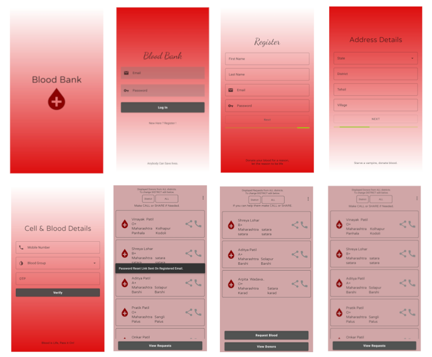

###  
 Blood Bank App

####Fetures

- Realtime database
- Make call directly to donor or requester
- Share on social media.
- Mobile Number verification using Firebase
- Cleaner interface
- Search by District
- Change Password by link.

#### Prerequisites :
- Android Studio
- Basic knowledge about Firebase Authentication and Realtime database.

#### How to Build this Project?
- Clone this project or Download Zip.
- Extract it and Open the Project in Android Studio.
- Wait to download required files.
- Connect project to firebase.
- Enable Firebase Email/Password and Phone Number Sign-In Methods from Sign-In Methods page.
- Set your apps SHA-1 hash in the Firebase Console (Without this you cant use Phone number authentication.)
- Build App
- Install it and Donate blood.

### FAQs
1. Phone Number Authentication not working.
--> Set Your Apps SHA-1 in the Firebase Console. Make sure you enabled Phone Number Sign-In Method.
2. App is crashing. What to do?
-->Send log on telegram [@Vinayak](http://t.me/vinayak_09). Will try to resolve.
3. Other Questions.
-->Feel free to Connect with me on Telegram [@vinayak_09](http://t.me/vinayak_09).

------------

Youtube Tutorial on How to Build This Project.
Link - Soon

